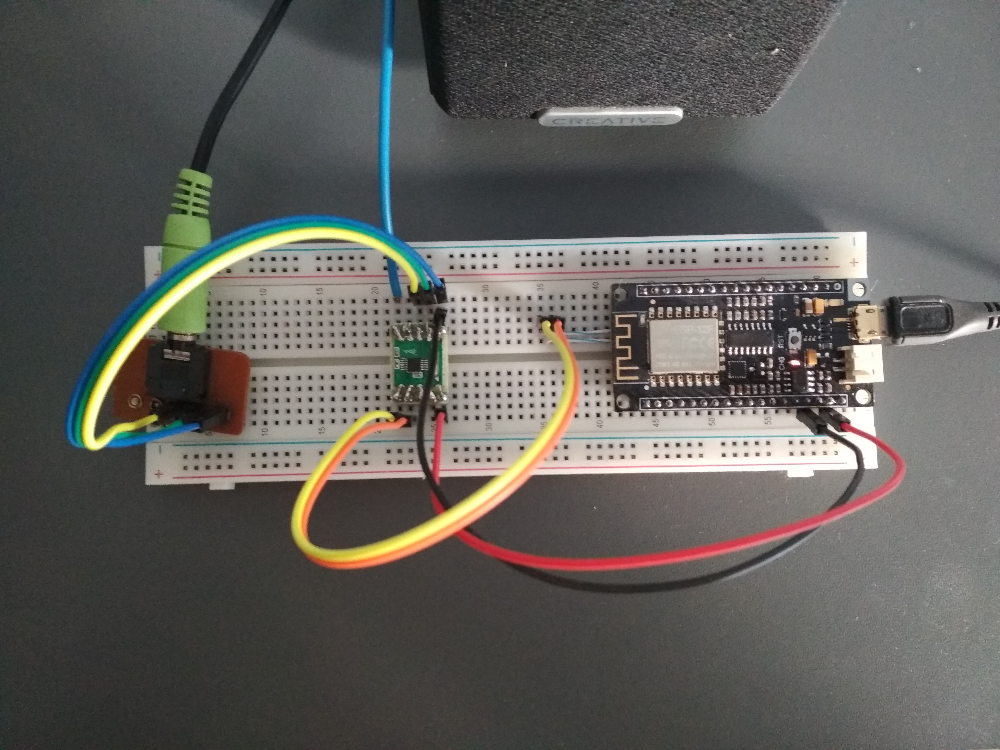

# FM Radio Receiver (ESP8622 + RDA5807M)

This is a very simple and cheap FM radio receiver, which I built using
ESP8266 board and RDA580 chip. I doesn't have any screen or buttons, it
can be controlled only with HTTP interface. I did that because I love
listening music and I was curious how python is doing on such small device.

## Hardware
* FireBeetle ESP8266 ([info](https://wiki.dfrobot.com/FireBeetle_ESP8266_IOT_Microcontroller_SKU__DFR0489))
* RDA5807M V2 ([info](https://cdn.instructables.com/ORIG/F41/ANYU/IN35R4FX/F41ANYUIN35R4FX.pdf))

## Software
* micropython ([repository](https://github.com/p3we/micropython/tree/esp8266-custom-modules))
* tinyweb ([repository](https://github.com/belyalov/tinyweb))

## Breadboard

* ESP8266 communicates with RDA5807M through pin 4 (sda) and 5 (scl).
* RDA5807M can be power from ESP8266
* RDA5807M has built in amplifier and can be connected directly to headphones or speaker.
* A wire can be used as antenna.

## Features
* Tune into given frequency
* Scan for radio stations
* Volume control and mute
* Simple Web interface
